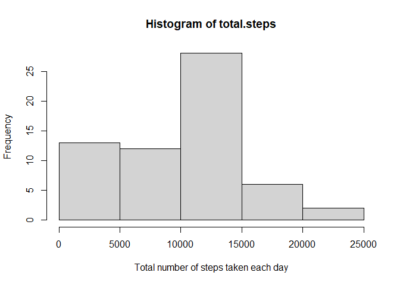
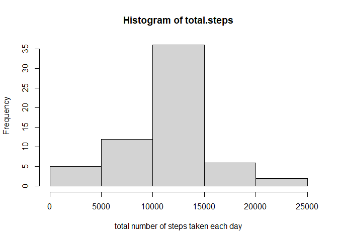

## Loading and preprocessing the data

```r
## reading activity data from zipped folder 
unzip(zipfile="repdata_data_activity.zip")
data <- read.csv("activity.csv")
```


## What is mean total number of steps taken per day?


```r
total.steps <- tapply(data$steps, data$date, FUN=sum, na.rm=TRUE)
hist(total.steps,xlab = "Total number of steps taken each day")
```

<!-- -->

Mean and median calculations day wise 


```r
act_mean<- mean(total.steps, na.rm=TRUE)
act_median<- median(total.steps, na.rm=TRUE)
```

Value of mean 

```r
print (act_mean)
```

```
## [1] 9354.23
```
value of median 

```r
print (act_median)
```

```
## [1] 10395
```

## What is the average daily activity pattern?

```r
library(ggplot2)
averages <- aggregate(x=list(steps=data$steps), by=list(interval=data$interval),
                      FUN=mean, na.rm=TRUE)
ggplot(data=averages, aes(x=interval, y=steps)) +
    geom_line() +
    xlab("5-minute interval") +
    ylab("average number of steps taken")
```

<!-- -->

The 5-minute interval which contains the maximum number of steps--On average across all the days in the dataset, 

```r
max_average<- averages[which.max(averages$steps),]
print(max_average)
```

```
##     interval    steps
## 104      835 206.1698
```


## Imputing missing values
1. Total number of missing values
There are missing values (coded as `NA`). The presence of missing values may affect some calculations 


```r
missing <- is.na(data$steps)
# How many missing
table(missing)
```

```
## missing
## FALSE  TRUE 
## 15264  2304
```


2. Filling NA's and 3.creating a new data set 


```r
# Replace each missing value with the mean value of its 5-minute interval
fill.value <- function(steps, interval) {
    filled <- NA
    if (!is.na(steps))
        filled <- c(steps)
    else
        filled <- (averages[averages$interval==interval, "steps"])
    return(filled)
}
filled.data <- data
filled.data$steps <- mapply(fill.value, filled.data$steps, filled.data$interval)
```
4. Based on the filled data, let us Make a histogram of the total number of steps taken each day and calculate the mean and median total number of steps.


```r
total.steps <- tapply(filled.data$steps, filled.data$date, FUN=sum)
hist(total.steps, xlab="total number of steps taken each day")
```

<!-- -->

```r
new_updated_mean<-mean(total.steps)
new_updated_median<-median(total.steps)
print(new_updated_mean)
```

```
## [1] 10766.19
```

```r
print(new_updated_median)
```

```
## [1] 10766.19
```

Impact of filling NAs: Mean and median values are higher after imputing missing data. The reason is that, in the original data, there are some days with `steps` values `NA` for any `interval`. The total number of steps taken in such days are set to 0s by default. However, after replacing missing `steps` values with the mean `steps` of associated `interval` value, these 0 values are removed from the histogram of total number of steps taken each day.

## Are there differences in activity patterns between weekdays and weekends?
Find the day of the week for each measurement in the dataset. We use the dataset with the filled-in values.


```r
weekday.or.weekend <- function(date) {
    day <- weekdays(date)
    if (day %in% c("Monday", "Tuesday", "Wednesday", "Thursday", "Friday"))
        return("weekday")
    else if (day %in% c("Saturday", "Sunday"))
        return("weekend")
    else
        stop("invalid date")
}
filled.data$date <- as.Date(filled.data$date)
filled.data$day <- sapply(filled.data$date, FUN=weekday.or.weekend)

averages <- aggregate(steps ~ interval + day, data=filled.data, mean)
ggplot(averages, aes(interval, steps)) + geom_line() + facet_grid(day ~ .) +  xlab("5-minute interval") + ylab("Number of steps")
```

<!-- -->

\"This completes the assignment"
